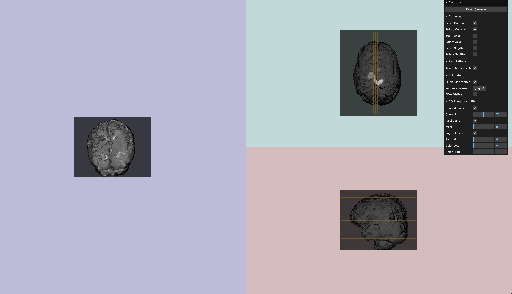

# [volume-viewer](https://volumeview-20a44.web.app/)



# Table of Contents <a name="tableOfContents"></a>

1. [Introduction](#introduction)

2. [Run the project locally](#runLocally)

3. [Deployment – Live website](#deploymentLiveWebsite)

## Introduction <a name="introduction"></a>

WebGL MRI volume visualization with THREE.js 

Volumes located in src/nrrd have been previously [converted](http://www.itksnap.org/pmwiki/pmwiki.php?n=Convert3D.Convert3D) from Nifti(.nii) to Nrrd format.  


## Run the project locally <a name="#runLocally"></a>

[Node.js](https://nodejs.org/en/), v 20.1 was used for development.  
Install [Vite](https://vitejs.dev/), a development server with live reload capability.

  - To install:
    
    ```
      npm i vite    # install vite
      npm i three   # install three.js 
    ```

  - To run (from the src directory):
        
    ```
      cd src
      npx vite
    ```

This runs the *index.html* with the javascript and three js components from *script.js*.  

## Deployment - Live Website <a name="#deploymentLiveWebsite"></a>

[volume-viewer](https://volumeview-20a44.web.app/) live website is currently deployed on [Firebase](https://firebase.google.com/), following vite [doc](https://vitejs.dev/guide/static-deploy.html#google-firebase).


## Credits <a name="credits"></a>
Done using [Three.js](https://threejs.org/) with the nrrd 3D object loader. 